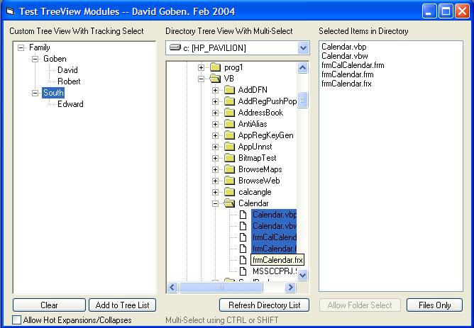



## Multi\-Select TreeView Demo

### Description

Demononstrate E-Z but sophisticated support of multi-select in a standard VB TreeView control, including hot-track select, hot-track auto-open/close folder, super-fast treeview clear, collection sorting, XP-stype buttons, and very fast as-needed folder node population. All easy to emplement. All features are stored in separate modules for easy plug-in to your apps. Code fully documented.
 
### More Info
 

             |
---                |---
**Submitted On**   |2004-02-12 22:14:16
**By**             |[David Ross Goben](https://github.com/Planet-Source-Code/PSCIndex/blob/master/ByAuthor/david-ross-goben.md)
**Level**          |Intermediate
**User Rating**    |5.0 (40 globes from 8 users)
**Compatibility**  |VB 6\.0
**Category**       |[VB function enhancement](https://github.com/Planet-Source-Code/PSCIndex/blob/master/ByCategory/vb-function-enhancement__1-25.md)
**World**          |[Visual Basic](https://github.com/Planet-Source-Code/PSCIndex/blob/master/ByWorld/visual-basic.md)
**Archive File**   |[Multi\-Sele1707962122004\.zip](https://github.com/Planet-Source-Code/david-ross-goben-multi-select-treeview-demo__1-51703/archive/master.zip)

